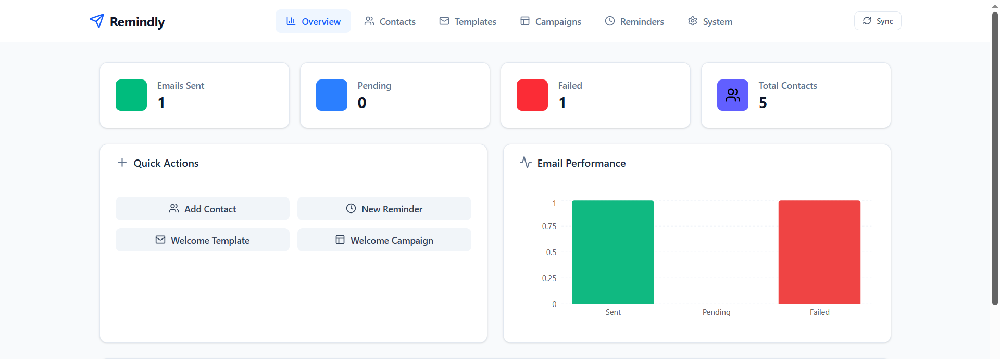
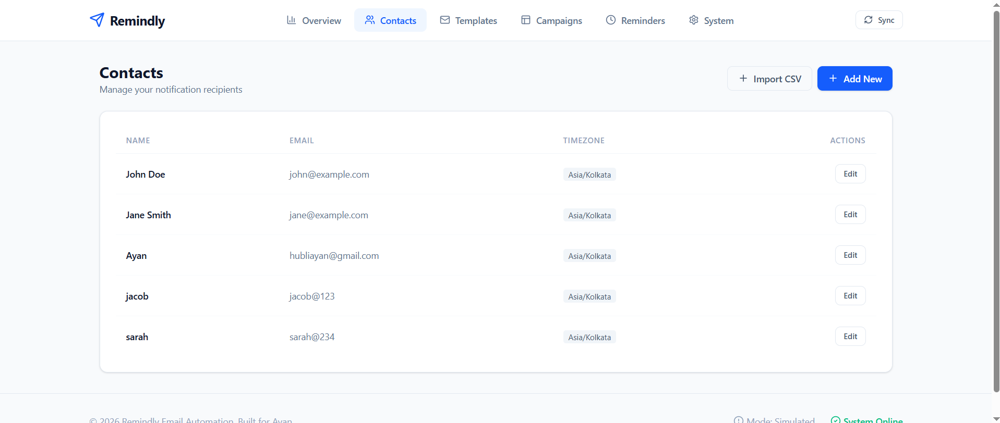
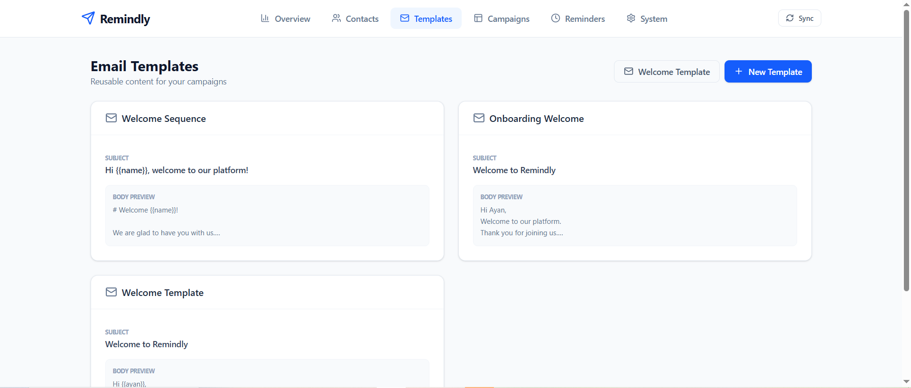
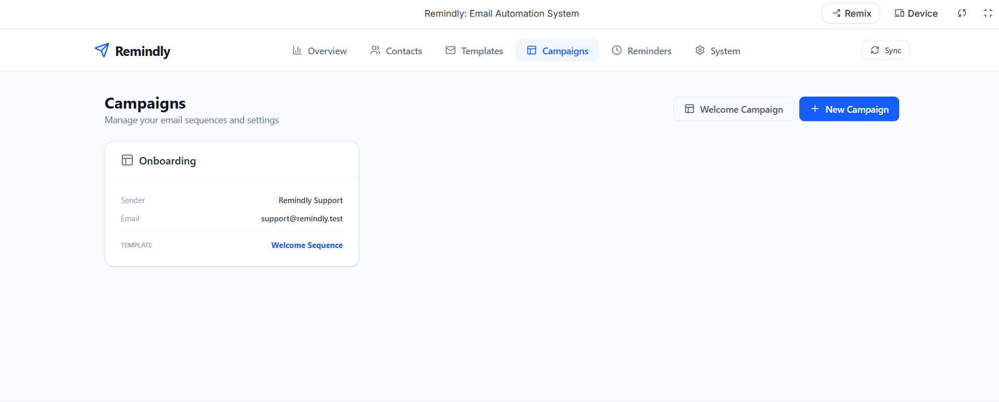
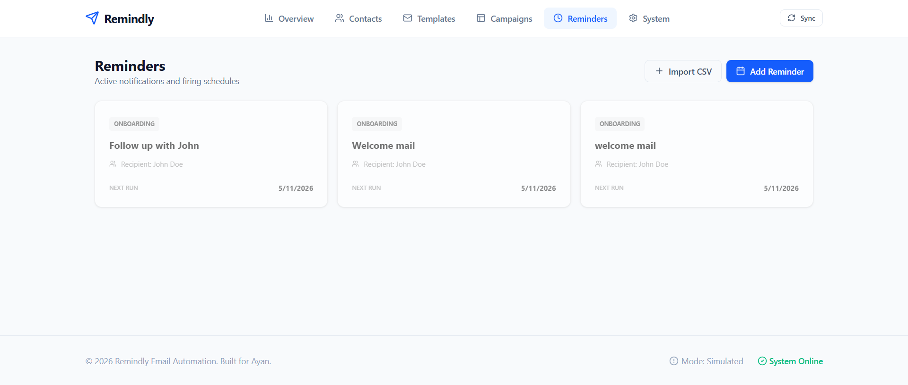
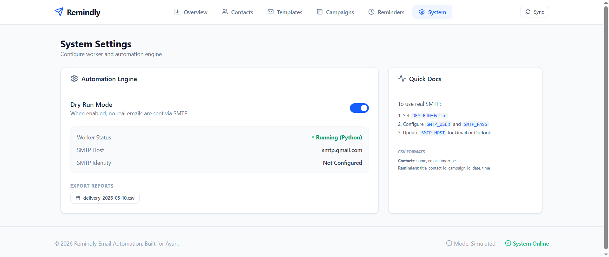

# Remindly Email Automation Platform

🔗 **[Live Demo](https://ais-pre-vj425uv5dptgs4kkkfmg4s-50948685477.asia-southeast1.run.app)**

A complete, enterprise-ready email automation and notification management platform built with a high-performance **React + Express + Python Worker** architecture.

## ⭐ Highlights

✅ React + Express + Python Worker Architecture  
✅ Gmail SMTP Integration  
✅ CSV Contact & Reminder Import  
✅ Dry-Run Simulation Mode  
✅ Delivery Tracking & CSV Reports  
✅ Real-Time Dashboard Analytics  
✅ Personalized Email Templates  

## ⚡ Overview

**Remindly** is a full-stack email automation and reminder management platform designed to simulate real-world notification systems used by HR teams, training platforms, startups, and operations teams.

The platform automates:
- Recurring reminders
- Onboarding emails
- Campaign scheduling
- Contact management
- SMTP-based email dispatch
- Delivery tracking and reporting

Built using a hybrid architecture, the project demonstrates real-world concepts such as scheduling engines, background workers, template rendering, CSV data pipelines, and automation workflows.

## 🌍 Industry Relevance

Email automation systems are widely used across:
- **HR onboarding workflows**: Automating welcome emails and document requests.
- **Webinar and training reminders**: Ensuring high attendance through timely notifications.
- **Customer engagement campaigns**: Driving retention with personalized content.
- **Invoice/payment reminders**: Streamlining accounts receivable.
- **Educational platforms**: Managing course updates and student alerts.

## 🏗 System Architecture & Workflow

```text
User Uploads CSV (Contacts/Reminders)
        ↓
Express API Processes Data & Validates
        ↓
SQLite Stores Centralized Records
        ↓
Python Worker Polls Scheduled Tasks (every 10s)
        ↓
SMTP Engine Applies Personalization & Sends
        ↓
Logs & Delivery Reports Generated
        ↓
Dashboard Displays Real-Time Analytics
```

## 📸 Project Screenshots

### Dashboard Overview


### Contacts Management


### Email Templates


### Campaign Management


### Reminder Scheduling


### System Settings & Python Worker


## 🧠 Engineering Concepts Demonstrated
- **Background Worker Architecture**: Offloading heavy/scheduled tasks to a separate process.
- **SMTP Email Automation**: Direct integration with mail servers for delivery.
- **CSV Data Ingestion**: Building robust pipelines for bulk data entry.
- **Template Personalization**: Custom string replacement engine for recipient data.
- **REST API Communication**: Structured data exchange between frontend and backend.
- **SQLite Persistence**: Local database management for state consistency.
- **Dashboard Analytics**: Real-time data visualization using Recharts.
- **Dry-Run Environments**: Safe testing modes for high-risk automation.

## ⚙️ Features in Action
- **Bulk Import**: Quickly populate your CRM using CSV files.
- **Markdown Templates**: Write emails in Markdown for rich formatting.
- **Intelligent Scheduling**: Precise control over when emails fire.
- **Safety First**: Toggle "Dry Run" mode to inspect logs without sending real mail.
- **Detailed Audit**: Download daily CSV logs of all delivery attempts.

## 🚀 Future Improvements
- **Redis/BullMQ**: Integration for high-concurrency queue management.
- **OAuth 2.0**: Support for Gmail API tokens instead of app passwords.
- **Open/Click Tracking**: In-depth engagement metrics via tracking pixels.
- **Multi-user Support**: Role-based access control for teams.
- **PostgreSQL**: Migration for production-scale deployments.

## 📚 Learning Outcomes

Through this project, I gained practical experience in:
- High-level full-stack system design and modularity.
- Implementing reliable asynchronous task processing.
- Managing secure SMTP communication and credential handling.
- Designing data-dense dashboards for monitoring industrial workflows.

## ▶️ Running the Project

### 1. Install Dependencies
```bash
npm install
# Ensure Python 3 is installed for the worker
```

### 2. Configuration
Create a `.env` file based on `.env.example`:
```env
SMTP_USER=your-email@gmail.com
SMTP_PASS=your-app-password
DRY_RUN=true # Set to false for real sending
```

### 3. Start the Platform
```bash
npm run dev
```
*The Express server will automatically attempt to spawn the `worker.py` process.*

---
© 2026 Remindly Email Automation. Built for Ayan.
